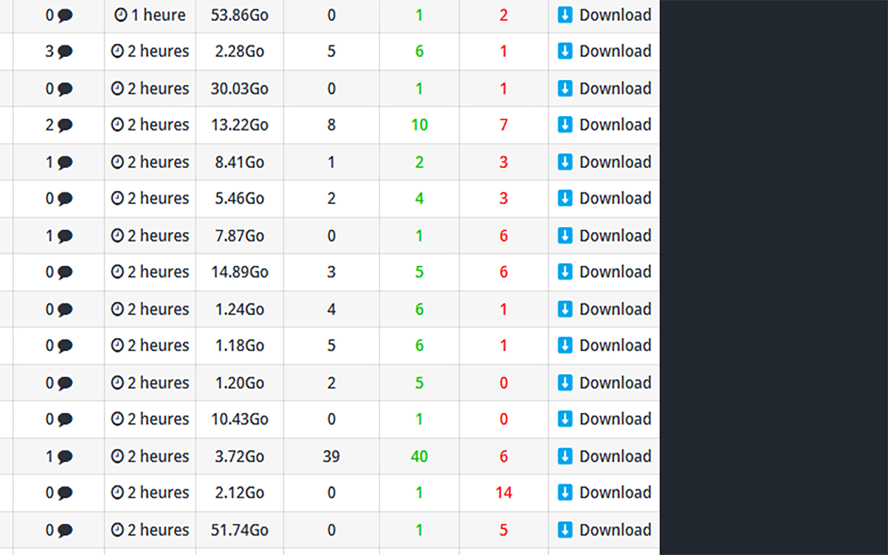

# YGG Downloader

YGG Downloader is a Chrome extension that enhances your experience on YGG torrent website by adding convenient download buttons directly to the torrent listings.

## Screenshot

## Features

- Adds a direct download button for each torrent in the listing
- Seamlessly integrates with YGG's interface
- Works on multiple YGG domains
- Lightweight and efficient

## Installation

1. Download or clone this repository
2. Open Chrome and go to `chrome://extensions/`
3. Enable "Developer mode" in the top right corner
4. Click "Load unpacked" and select the extension directory

## How It Works

Once installed, the extension automatically adds a new "Actions" column to torrent listings on YGG websites. Each row will have a "Télécharger" (Download) button that allows you to directly download the torrent file without additional clicks.

## Supported Domains

The extension works on the following YGG domains:
- *.yggtorrent.top

## Development

The extension is built using vanilla JavaScript and follows the Chrome Extension Manifest V3 specifications. It uses content scripts to inject the download functionality into YGG pages.

## License

This project is licensed under the MIT License - see the [LICENSE](LICENSE) file for details.